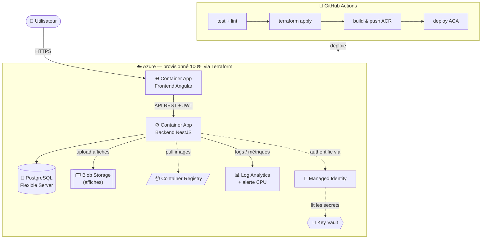

<div align="center">

# 🎬 Median

**Plateforme cloud-native de gestion et de réservation de cinéma**

[](https://github.com/PathMan21/median/actions/workflows/ci-cd.yml)


</div>

> Projet **LearnStudio** — module *Développer pour le Cloud*, Mastère 2 Ynov (2025/2026).
> Une application full-stack TypeScript déployée de bout en bout sur Azure, 100 % par Infrastructure as Code et CI/CD.

---

## 📋 Sommaire

- [Aperçu](#-aperçu)
- [Architecture](#️-architecture)
- [Stack technique](#-stack-technique)
- [Fonctionnalités](#-fonctionnalités)
- [Démarrage rapide (local)](#-démarrage-rapide-local)
- [Déploiement cloud](#️-déploiement-cloud)
- [Pipeline CI/CD](#-pipeline-cicd)
- [Sécurité](#-sécurité)
- [Structure du dépôt](#-structure-du-dépôt)
- [Équipe](#-équipe)

---

## 🔎 Aperçu

Median permet aux utilisateurs de découvrir un catalogue de films, consulter les cinémas
et gérer leurs réservations. Les administrateurs disposent d'un back-office complet
(CRUD films & cinémas, upload d'affiches). L'objectif pédagogique : démontrer la maîtrise
d'une chaîne cloud complète — conteneurisation, IaC, CI/CD, services managés, sécurité et observabilité.

### 🔗 Accès à l'application

| Service | URL |
|---|---|
| 🌐 Frontend | _affichée à la fin du pipeline (`deploy` → résumé du run)_ |
| ⚙️ API Backend | _idem_ |
| 📚 Documentation Swagger | `<backend_url>/api` |

> Les URLs publiques Azure sont générées par Terraform et **affichées automatiquement
> dans le résumé du run GitHub Actions** à chaque déploiement.

---

## 🏗️ Architecture



**Flux applicatif** — le frontend Angular consomme l'API NestJS via des tokens JWT.
Le backend récupère ses secrets (`DATABASE_URL`, `JWT_SECRET`, connection string Blob)
depuis **Azure Key Vault** grâce à une **Managed Identity** : aucun secret n'est présent
dans le code ni dans les images. Les affiches de films sont stockées sur **Azure Blob Storage**.
L'ensemble de l'infrastructure est décrit en **Terraform** et déployé par **GitHub Actions**.

---

## 🚀 Stack technique

| Couche | Technologies |
|---|---|
| **Frontend** | Angular 19 (standalone components, signals), Tailwind CSS 4 |
| **Backend** | NestJS 11, Prisma 6 (ORM), Swagger / OpenAPI |
| **Base de données** | PostgreSQL 16 (Azure Database Flexible Server) |
| **Stockage objet** | Azure Blob Storage (Azurite en local) |
| **Bus de messages** | NATS (traitements asynchrones) |
| **Authentification** | JWT (Passport) |
| **Infrastructure as Code** | Terraform (provider `azurerm`), remote state Azure Storage, modules |
| **Cloud** | Azure Container Apps, Container Registry, Key Vault, Log Analytics |
| **CI/CD** | GitHub Actions — `test → infra → build/push → deploy` (OIDC, cache npm & Docker) |

---

## ✨ Fonctionnalités

- 🔐 **Authentification JWT** — inscription, vérification e-mail, connexion sécurisée
- 🎞️ **Catalogue de films** — consultation publique, CRUD administrateur
- 🏢 **Gestion des cinémas** — CRUD administrateur
- 🎫 **Réservations** — calcul dynamique du prix
- 🖼️ **Upload d'affiches vers Blob Storage** — `POST /films/:id/poster`
- 📡 **Événements asynchrones** — publication `user.registered` sur NATS à l'inscription
- 📚 **API documentée** — Swagger UI sur `/api`

---

## 🧑‍💻 Démarrage rapide (local)

**Prérequis :** Docker + Docker Compose.

```bash
cp .env.example .env          # ajustez les valeurs si besoin
docker compose up --build
```

| Service | URL locale |
|---|---|
| Frontend | http://localhost:8081 |
| API Backend | http://localhost:3000 |
| Swagger | http://localhost:3000/api |

L'environnement local démarre **PostgreSQL, Azurite (Blob), NATS, le backend et le frontend**.
Les migrations Prisma sont appliquées automatiquement au démarrage du conteneur backend.

<details>
<summary>Lancer le backend seul (sans Docker)</summary>

```bash
cd backend
npm install
npm run prisma:generate
npm run prisma:migrate
npm run prisma:seed
npm run start:dev
```
</details>

---

## ☁️ Déploiement cloud

### 1. Bootstrap du remote state (une seule fois)

```bash
az group create -n tfstate-rg -l francecentral
az storage account create -n <nom_unique_state> -g tfstate-rg -l francecentral --sku Standard_LRS
az storage container create -n tfstate --account-name <nom_unique_state> --auth-mode login
```

### 2. Secrets GitHub Actions

| Secret | Description |
|---|---|
| `AZURE_CLIENT_ID` · `AZURE_TENANT_ID` · `AZURE_SUBSCRIPTION_ID` | Service principal (authentification **OIDC**, sans mot de passe) |
| `TFSTATE_RG` · `TFSTATE_SA` · `TFSTATE_CONTAINER` | Backend Terraform (remote state) |
| `POSTGRES_ADMIN_PASSWORD` | Mot de passe administrateur PostgreSQL |
| `JWT_SECRET` | Secret de signature des tokens JWT |

> Le service principal doit disposer des rôles **Contributor + User Access Administrator**
> (ou **Owner**) sur la souscription — Terraform crée des attributions de rôles (AcrPull, accès Key Vault).

### 3. Déploiement

Un simple `git push` sur `master` déclenche le pipeline complet. En manuel :

```bash
cd infra
export TF_VAR_postgres_admin_password="..." TF_VAR_jwt_secret="$(openssl rand -hex 32)"
terraform init \
  -backend-config="resource_group_name=tfstate-rg" \
  -backend-config="storage_account_name=<nom_unique_state>" \
  -backend-config="container_name=tfstate" \
  -backend-config="key=learnstudio.tfstate"
terraform apply
terraform output frontend_url backend_url
```

### 4. Initialiser les données (une fois, après déploiement)

```bash
az containerapp exec -n <backend_app> -g <resource_group> --command "npx prisma db seed"
```

---

## 🔄 Pipeline CI/CD

Le workflow [`.github/workflows/ci-cd.yml`](.github/workflows/ci-cd.yml) s'exécute en 4 étapes séquentielles :

| Étape | Rôle |
|---|---|
| **1. test** | `npm ci` (cache), `prisma generate`, **lint** backend + frontend, tests unitaires, build frontend |
| **2. infra** | `terraform plan` + `apply` — crée/met à jour toute l'infrastructure Azure |
| **3. build-push** | Build des images Docker (cache GHA) et push vers l'ACR |
| **4. deploy** | Met à jour les Container Apps sur les nouvelles images, puis **affiche les URLs publiques** |

Un verrou de concurrence garantit un seul déploiement à la fois (pas de corruption du state).

---

## 🔒 Sécurité

- ✅ **Aucun secret en dur** dans le code ou les images
- ✅ Secrets centralisés dans **Azure Key Vault**, injectés via **Managed Identity**
- ✅ Authentification cloud par **OIDC** (pas de clé secrète stockée dans GitHub)
- ✅ Communication base de données en **SSL/TLS**
- ✅ Images Docker **multi-stage** (surface d'attaque réduite)

---

## 📂 Structure du dépôt

```
median/
├── frontend/              # Application Angular 19 + Dockerfile
├── backend/               # API NestJS + Prisma + modules storage (Blob) & events (NATS)
├── infra/                 # Terraform (IaC)
│   ├── main.tf            # Resource Group, identité, orchestration des modules
│   └── modules/           # registry · database · storage · keyvault · observability · containerapps
├── k8s/                   # Manifests Kubernetes (héritage — non utilisés pour la prod Azure)
├── .github/workflows/
│   └── ci-cd.yml          # Pipeline GitHub Actions
├── docker-compose.yml     # Environnement de développement local complet
└── docs/                  # Documentation projet
```

---

## 👥 Équipe

| Membre | GitHub |
|---|---|
| **Enzo Chamanier** | [@enzocfrance](https://github.com/enzocfrance) |
| **Manon Lafosse** | [@PathMan21](https://github.com/PathMan21) |
| **Alexandre Gibault** | [@Alexandre-gibault-ynov](https://github.com/Alexandre-gibault-ynov) |
| **Clément Vitrat** | [@clement-vitrat](https://github.com/clement-vitrat) |
---

<div align="center">
<sub>Réalisé dans le cadre du Mastère 2 Ynov — Développer pour le Cloud · 2026</sub>
</div>
