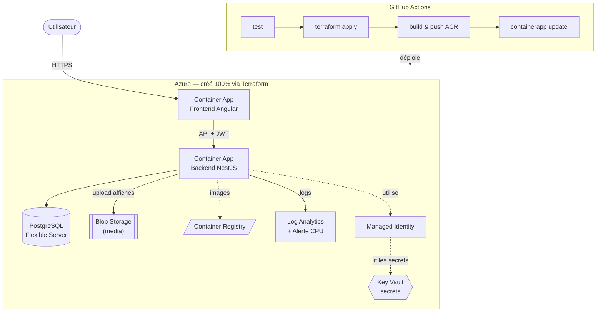

# Median — Plateforme de Gestion de Cinéma 🎬

Median est une application web de gestion de réservations de cinéma : découverte de films,
consultation des salles, gestion des réservations, et back-office d'administration du catalogue.
Projet **LearnStudio** — Développer pour le Cloud (Mastère 2 Ynov).

## 👥 Équipe

| Membre | Rôle |
|---|---|
| Enzo Chamanier | _(à compléter)_ |
| _(à compléter)_ | _(à compléter)_ |

---

## 🏗️ Architecture



**Flux** : le frontend Angular appelle l'API NestJS (JWT). Le backend lit ses secrets
(`DATABASE_URL`, `JWT_SECRET`, connection string Blob) depuis **Key Vault** via une
**Managed Identity** — aucun secret dans le code. Les affiches de films sont uploadées
vers **Azure Blob Storage**. Toute l'infra est provisionnée par **Terraform** et déployée
par **GitHub Actions**.

## 🚀 Technologies

| Couche | Choix |
|---|---|
| Frontend | Angular 19 (standalone, signals), Tailwind CSS 4 |
| Backend | NestJS 11, Prisma 6, Swagger |
| Base de données | **PostgreSQL 16** |
| Stockage objet | Azure Blob Storage (Azurite en local) |
| Bus de messages | NATS |
| Auth | JWT (Passport) |
| IaC | Terraform (`azurerm`), remote state Azure Storage |
| Cloud | Azure Container Apps + ACR + Key Vault + Log Analytics |
| CI/CD | GitHub Actions (test → infra → build/push → deploy) |

---

## 🛠️ Développement local (docker-compose)

Tout l'environnement (Postgres, Azurite, NATS, backend, frontend) se lance d'un coup :

```bash
cp .env.example .env   # ajuster si besoin
docker compose up --build
```

- API : `http://localhost:3000` — Swagger : `http://localhost:3000/api`
- Frontend : `http://localhost:8081`

### Sans Docker (backend seul)

```bash
cd backend
npm install
npm run prisma:generate
npm run prisma:migrate
npm run prisma:seed
npm run start:dev
```

---

## ☁️ Déploiement (Infrastructure as Code)

### Bootstrap unique — remote state

Le state Terraform est stocké dans un Storage Account Azure. À créer **une seule fois** :

```bash
az group create -n tfstate-rg -l francecentral
az storage account create -n learnstudiotfstate -g tfstate-rg -l francecentral --sku Standard_LRS
az storage container create -n tfstate --account-name learnstudiotfstate
```

### Secrets GitHub Actions à configurer

| Secret | Description |
|---|---|
| `AZURE_CLIENT_ID` / `AZURE_TENANT_ID` / `AZURE_SUBSCRIPTION_ID` | Service principal OIDC |
| `TFSTATE_RG` / `TFSTATE_SA` / `TFSTATE_CONTAINER` | Backend remote state |
| `POSTGRES_ADMIN_PASSWORD` | Mot de passe admin PostgreSQL |
| `JWT_SECRET` | Secret JWT du backend |
| `MAIL_PASSWORD` | Mot de passe SMTP |

> Le service principal doit avoir **Contributor + User Access Administrator** (ou Owner)
> sur la souscription, car Terraform crée des role assignments (AcrPull).

### Déploiement

`git push` sur `master` déclenche le pipeline complet. En manuel :

```bash
cd infra
export TF_VAR_postgres_admin_password=... TF_VAR_jwt_secret=...
terraform init -backend-config="resource_group_name=tfstate-rg" \
  -backend-config="storage_account_name=learnstudiotfstate" \
  -backend-config="container_name=tfstate" -backend-config="key=learnstudio.tfstate"
terraform apply
terraform output backend_url frontend_url
```

---

## 📂 Structure du dépôt

```
median/
├── frontend/            # Angular 19 + Dockerfile
├── backend/             # NestJS + Prisma + module storage (Blob)
├── infra/               # Terraform (ACA, ACR, Postgres, Key Vault, observabilité)
│   └── modules/         # registry, database, storage, keyvault, observability, containerapps
├── k8s/                 # (legacy) manifests Kubernetes — non utilisés pour la prod notée
├── .github/workflows/   # deploy.yml (CI/CD)
├── docker-compose.yml   # env de dev local complet
└── docs/PLAN-SESSION6.md # plan d'action des livrables
```

---

## 🌟 Fonctionnalités

- Authentification JWT (inscription / connexion sécurisées)
- CRUD films & cinémas (admin)
- **Upload d'affiches de films vers Blob** (`POST /films/:id/poster`)
- Réservations avec calcul dynamique du prix
- Documentation Swagger
