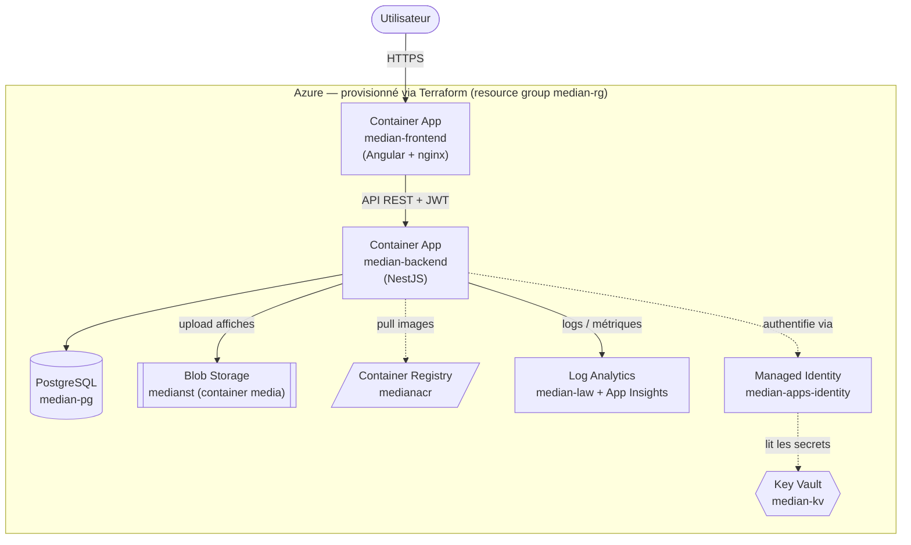

# Architecture — median

Plateforme de gestion et de réservation de cinéma, déployée en **serverless** sur Azure,
100 % via Infrastructure as Code et CI/CD.

## Vue d'ensemble

## Flux d'une requête

1. L'utilisateur accède au **frontend** (Angular servi par nginx) via son URL publique HTTPS.
2. Le frontend appelle l'**API backend** (NestJS) — l'URL du backend est injectée au démarrage
   du conteneur (variable `API_URL`), le CORS est activé côté backend.
3. Le backend valide le **JWT**, exécute la logique métier, lit/écrit dans **PostgreSQL**.
4. Pour les affiches de films, le backend stocke les fichiers sur **Azure Blob Storage**.
5. Le backend récupère ses **secrets** (DATABASE_URL, JWT_SECRET, connection string Blob)
   depuis **Key Vault**, via la **Managed Identity** — aucun secret en clair.
6. Tous les logs des conteneurs remontent dans **Log Analytics**.

## Stack technique

| Couche | Technologie |
|---|---|
| Frontend | Angular 19 (standalone, signals), Tailwind CSS 4, servi par nginx |
| Backend | NestJS 11, Prisma 6 (ORM), Swagger |
| Base de données | PostgreSQL 16 (Azure Database Flexible Server) |
| Stockage objet | Azure Blob Storage (Azurite en local) |
| Bus de messages | NATS (événements asynchrones) |
| Authentification | JWT local (Passport) |
| Secrets | Azure Key Vault + Managed Identity |
| IaC | Terraform (`azurerm`), remote state Azure Storage, modules |
| Cloud (compute) | Azure Container Apps (serverless) |
| CI/CD | GitHub Actions (OIDC, cache npm & Docker) |

## Ressources Azure (resource group `median-rg`)

### Compute (serverless)
- **median-aca-env** — environnement Container Apps, socle serverless qui héberge les apps et les relie aux logs
- **median-backend** — API NestJS (Container App, port 3000, ingress externe)
- **median-frontend** — front Angular servi par nginx (Container App, port 80, ingress externe)

### Sécurité
- **median-kv-*** — Key Vault, stocke les secrets
- **median-apps-identity** — Managed Identity (User-Assigned) utilisée pour lire le Key Vault et tirer les images

### Observabilité
- **median-law** — Log Analytics (logs des conteneurs)
- **median-appi** — Application Insights (télémétrie/APM)
- **median-ag** — Action Group (destinataire des alertes par email)
- **median-backend-cpu-high** — alerte métrique (CPU > 0.8 vCPU → email)

### Données / artefacts
- **medianacr*** — Container Registry (images Docker)
- **median-pg-*** — PostgreSQL Flexible Server (base `median-db`)
- **medianst*** — Storage Account (Blob, container `media`)

## Scalabilité

Le compute est **serverless** : auto-scaling via `min_replicas`/`max_replicas`
(backend 1→3, frontend 1→2), facturation à l'usage, aucune VM à gérer.

## Voir aussi
- [DEPLOIEMENT.md](DEPLOIEMENT.md) — guide de déploiement
- [CHOIX-TECHNIQUES.md](CHOIX-TECHNIQUES.md) — justification des choix
- [EXPLOITATION.md](EXPLOITATION.md) — logs, seed, dépannage
